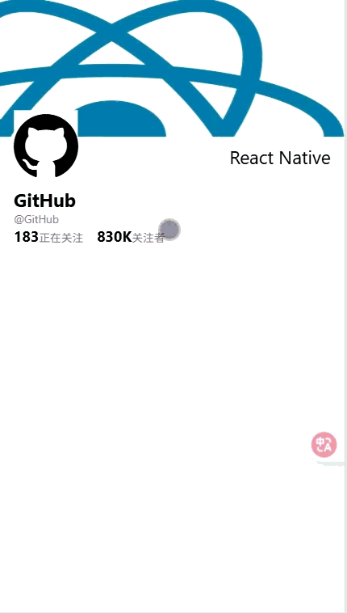

# React Native 30 Days Learning Project

一个用于学习 React Native 的 30 天项目，包含 30 个不同的示例和演示。

## 📱 项目概述

这个项目旨在通过 30 天的实践来学习 React Native 开发。每天完成一个不同的功能或组件，涵盖 React Native 的核心概念和常用功能。

## 🚀 快速开始

### 前置要求
- Node.js (推荐 20+)
- npm 或 yarn
- Expo CLI (可选)

### 安装依赖
```bash
npm install
```

### 启动开发服务器
```bash
npm start
```

### 运行在特定平台
```bash
# Android
npm run android

# iOS
npm run ios

# Web
npm run web
```

## 📅 每日项目

### Day 1 - 计时器


### Day 2 - 轮播图


### Day 3 - twitter进入动画


### Day 4 - 相机
手机上运行

### Day 5 - 拖动动画


### Day 6 - 本地存储
手机上运行

### Day 7 - 选择图片
手机 运行

### Day 8 - 调用手机震动
手机上运行

### Day 9 - 抽屉

### Day 10 - 粘性头部动画



## 🛠️ 技术栈

- **框架**: React Native + Expo
- **导航**: React Navigation
- **状态管理**: React Hooks
- **类型检查**: TypeScript
- **代码质量**: ESLint


## 🙏 鸣谢

这个项目受到以下优秀资源的启发：

- **[30-days-of-react-native](https://github.com/fangwei716/30-days-of-react-native)** - 提供了项目灵感和初始结构
- **[Expo](https://expo.dev/)** - 优秀的 React Native 开发平台
- **[React Native](https://reactnative.dev/)** - 强大的跨平台移动应用框架

⭐ 如果这个项目对你有帮助，请给它一个 star！
